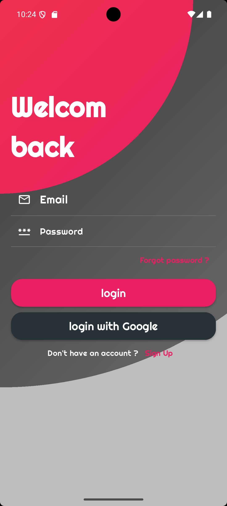
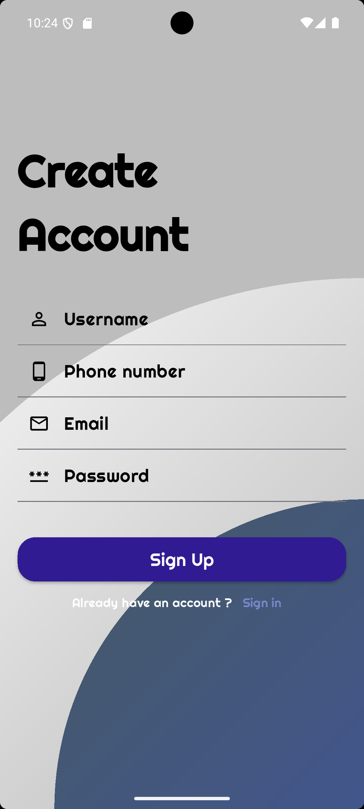
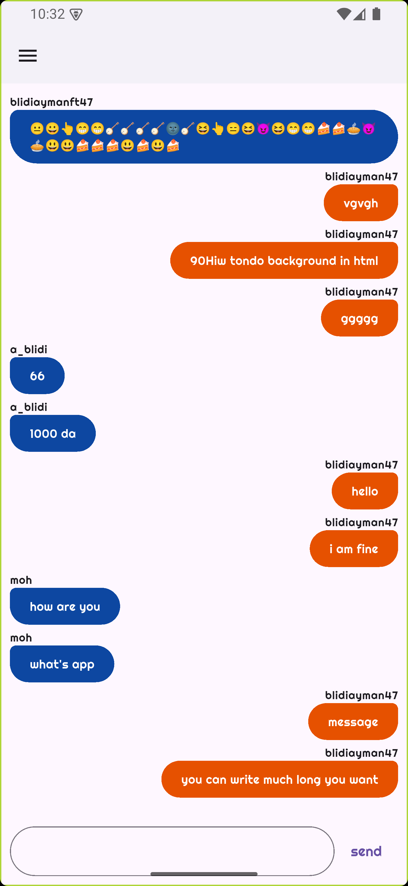
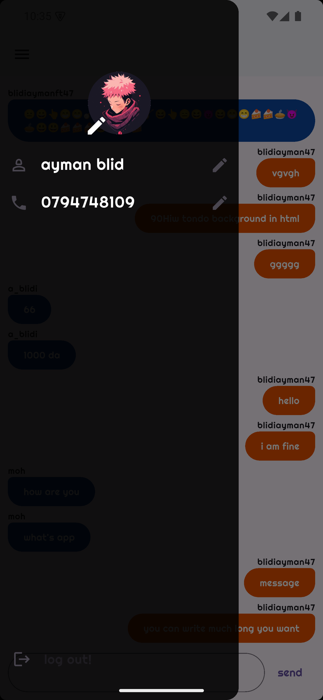
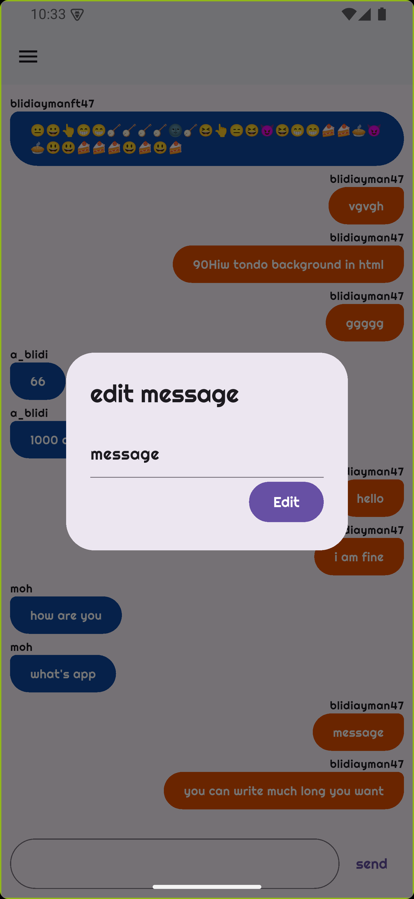

# Flutter Chat App

## Description
A simple and intuitive chat app built with Flutter and firebase. This app allows user to send and recive messages in realtime, all in one conversation.

## Features
- Authentication with firebase
    - Registration
    - Login with email and password
    - Login with Google
    - Forget/reset password
    - Edit profile (profile pic, phone, email, username...)
- Realtime text messaging with firebase
- storing images in firebase storage

## Screenshots
<table>
<h4>Authentication Screens</h4>
  <tr>
    <td></td>
    <td></td>
  </tr>
</table>
<table>
<h4>App Screens</h4>
  <tr>
    <td></td>
    <td></td>
  </tr>
  <tr>
    <td></td>
  </tr>
</table>

## Installation
1. Clone the repository:
   ```bash
   git clone https://github.com/AymanBld/mini-chat-app.git
2. Navigate to the project directory:
   ```bash
   cd mini-chat-app
3. Install dependencies:
   ```bash
   flutter pub get
4. Set up Firebase:

    - Go to the Firebase [Console](https://console.firebase.google.com/).
    
    - Create a new project (e.g., mini-chat-app).
    
    - Add an app (Android / ios) to your Firebase project.
    
    - Follow the steps to configure firebase with your app.
                
    - In the Firebase Console, enable Firebase services: Authentication (Email/Password and Google), Firestore, Storage

5. Run the app: 
   ```bash
   flutter run
